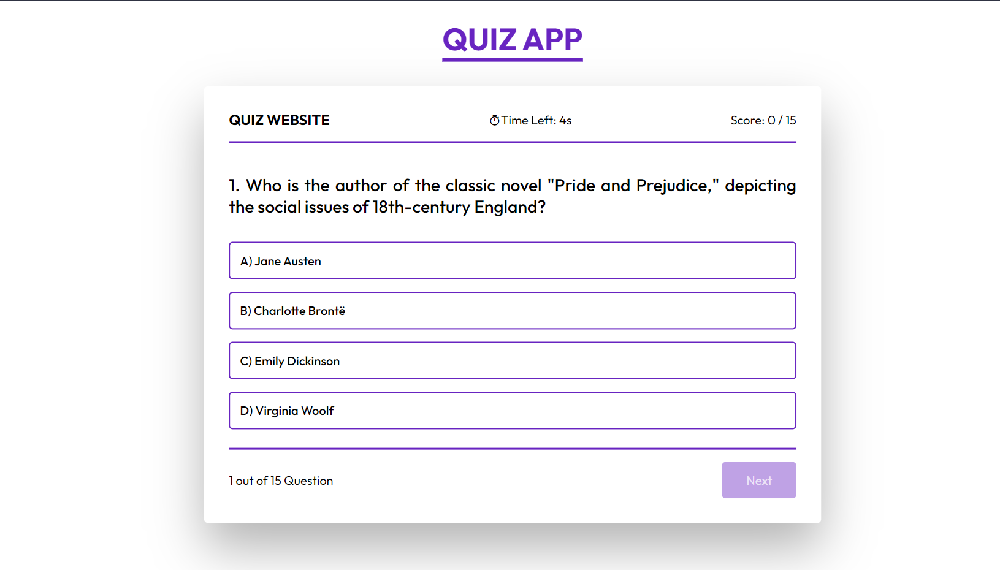
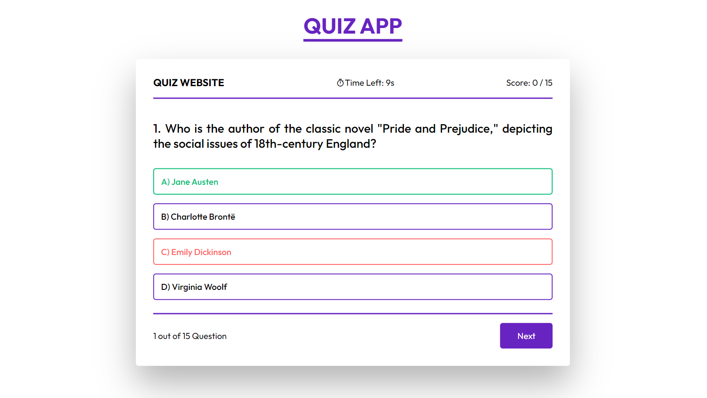
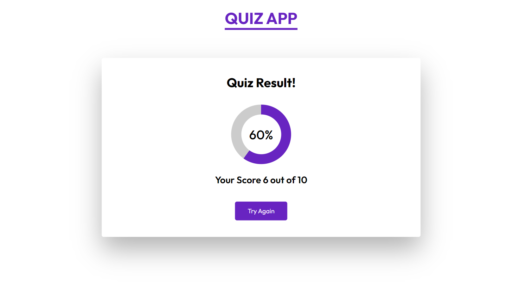

# Quiz App

Welcome to the Quiz App repository! This project is a web application built with HTML, CSS, and JavaScript, designed to provide an engaging quiz experience. The app includes a circular progress indicator, time limit for each question, and visual feedback for correct and wrong answers. The modern UI design enhances the overall user experience, making it enjoyable and interactive.

## Preview

### 1. Start Game

### 2. Choose Option, Indicate Correct/Wrong, and Display Correct Answer

### 3. Showing Result with Animated Circular Progress

## Features

- **Start Quiz:** Begin the quiz and answer questions within a time limit.
- **Choose Options:** Select the desired option for each question.
- **Indicate Correct/Wrong:** Visual feedback for correct and wrong answers.
- **Display Correct Answer:** Show the correct answer if the user chooses the wrong option.
- **Circular Progress Indicator:** Animated circular progress indicator for a dynamic visual experience.
- **Modern UI Design:** Sleek layout and visually appealing design for an enjoyable user interface.

## Usage

1. Open the `index.html` file in your preferred web browser.
2. Click "Start Game" to begin the quiz.
3. Choose the correct option for each question within the time limit.
4. Visual feedback for correct and wrong answers will be provided.
5. If a wrong option is chosen, the correct answer will be displayed.
6. View the final result with an animated circular progress indicator.

## Customization

Feel free to customize this project to fit your preferences. Update styles, colors, and layout directly in the HTML and CSS files. You can modify the quiz questions and options by editing the JavaScript file (`quiz.js`). Additionally, you can extend the functionality to include more features or customization options.

## Contributing

If you'd like to contribute to this project, follow these steps:

1. Fork the repository.
2. Create a new branch for your feature or improvement.
3. Make your changes and commit them with descriptive messages.
4. Push your changes to your forked repository.
5. Open a pull request to merge your changes into the main branch.

Explore the Quiz App, challenge your knowledge, and consider contributing to its development. Thank you for checking out the repository!